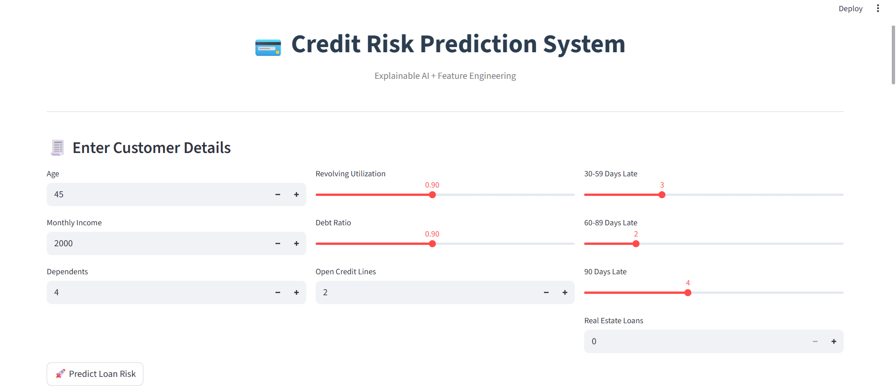
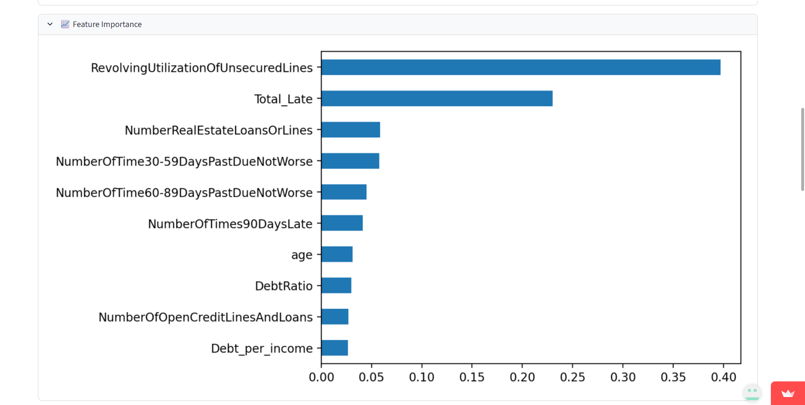
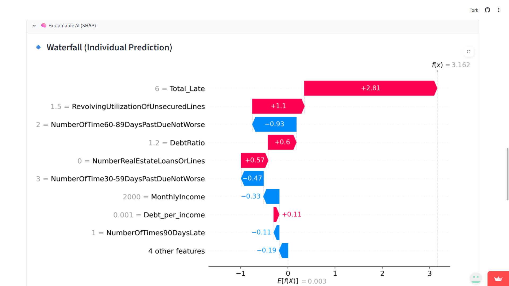

# 💳 Credit Risk Prediction System

## 📌 Overview

An end-to-end machine learning project that predicts the probability of a customer defaulting on a loan.

The system uses **XGBoost** for high-performance prediction, handles imbalanced data using **SMOTE**, and provides an interactive **Streamlit web application** for real-time predictions. It also includes **Explainable AI (SHAP)** to interpret model decisions.

---

## 🚀 Key Features

* End-to-end ML pipeline
* Imbalanced data handling using SMOTE
* High-performance XGBoost model
* Interactive Streamlit UI
* Model evaluation with multiple metrics
* Explainability using SHAP

---

## 🛠️ Tech Stack

* Python
* Pandas, NumPy
* Scikit-learn
* XGBoost
* SHAP
* Matplotlib, Seaborn
* Streamlit

---

## 📸 Application Demo

### 🔹 App Interface



User-friendly interface for entering customer details and predicting credit risk.

---

### 🔹 Prediction Result


Displays risk level along with key contributing factors.

---

### 🔹 Confusion Matrix


📊 Confusion Matrix showing model performance on test data.

---

### 🔹 Feature Importance



📊 Identifies the most important features influencing predictions.

---

### 🔹 Correlation Heatmap


📊 Shows relationships between different financial features.

---

### 🔹 SHAP Explainability



📊 Explains how each feature contributes to individual predictions.

---

## 📁 Project Structure

```
app.py
credit_risk_prediction.ipynb
loan_model.pkl
columns.pkl
requirements.txt
```

---

## ▶️ Run Locally

```
pip install -r requirements.txt
streamlit run app.py
```

---

## 📈 Business Impact

* Helps financial institutions identify high-risk customers
* Reduces loan default losses
* Supports data-driven credit decision making

---

## 🔮 Future Improvements

* Model tuning for better performance
* Deploy using cloud platforms
* Add API support

---

## 👨‍💻 Author

Yeshwanth
